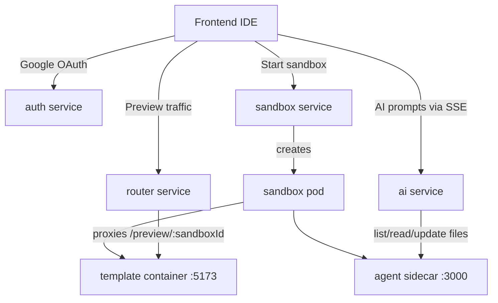

# Antigravity Sandbox

Antigravity Sandbox is a Kubernetes-backed cloud IDE that provisions isolated React and Vite workspaces on demand. Each session gets a live preview, a file explorer, a Monaco editor, an integrated terminal, and an AI copilot that can inspect and edit the workspace in real time.

## What You Get

- On-demand sandbox creation in Kubernetes
- Per-sandbox preview and agent services
- AI-assisted file editing through LangChain and MistralAI
- Google OAuth login with MongoDB-backed user records
- A React 19 frontend with Monaco, xterm.js, Socket.IO, and Tailwind CSS

## Architecture



## Repository Layout

```text
auth/             Google OAuth + MongoDB auth API
ai/               LangChain + MistralAI orchestration API
frontend/         React IDE client
k8s/              Kubernetes manifests, ingress, and RBAC
sandbox/server/   sandbox pod and service orchestrator
sandbox/router/    preview proxy and WebSocket upgrade handler
sandbox/agent/    file API and terminal sidecar
sandbox/template/  starter Vite React app copied into each sandbox
notes/, project/   design notes and implementation docs
skaffold.yaml     local build/deploy config for the sandbox stack
```

## Services

| Service | Entry File | Default Port | Purpose |
| --- | --- | --- | --- |
| `auth` | `auth/server.js` | `4001` | Google OAuth login, MongoDB user persistence, and JWT cookie issuance |
| `ai` | `ai/server.js` | `3000` | Streams AI responses over SSE and calls workspace tools |
| `sandbox/server` | `sandbox/server/server.js` | `3000` | Creates sandbox pods and services through the Kubernetes API |
| `sandbox/router` | `sandbox/router/server.js` | `3000` | Proxies preview traffic to the correct sandbox service |
| `sandbox/agent` | `sandbox/agent/server.js` | `3000` | Exposes file operations and a PTY-backed terminal over Socket.IO |
| `sandbox/template` | `sandbox/template/vite.config.js` | `5173` | Starter React/Vite app that is seeded into each new sandbox |
| `frontend` | `frontend/src/main.jsx` | `5173` | Main browser IDE with file explorer, editor, preview, terminal, and AI chat |

## How It Works

1. The user opens the frontend and clicks the sandbox launch action.
2. The frontend calls `POST /api/sandbox/start` on the sandbox service.
3. The sandbox service creates a pod and two ClusterIP services for the preview and the agent.
4. The init container seeds the workspace from `sandbox/template`, then the preview container runs Vite and the agent sidecar exposes the workspace API and terminal.
5. The router serves preview traffic from `/preview/:sandboxId/` and keeps the live preview reachable.
6. The terminal component connects to the agent with Socket.IO.
7. The AI service streams tool activity and model output back to the frontend over Server-Sent Events.

The preview and agent containers share the same `/workspace` volume, so file edits made by the AI or the file explorer appear immediately in the live preview.

## Prerequisites

- Node.js 20 or newer
- npm
- Docker if you want to build container images
- Kubernetes and `kubectl` if you want to run the manifests
- MongoDB access for the auth service
- Google OAuth credentials for login
- A Mistral API key for the AI service

## Install Dependencies

This repository is organized as multiple independent Node packages, so install dependencies in each service directory.

```bash
cd auth && npm install
cd ai && npm install
cd sandbox/server && npm install
cd sandbox/router && npm install
cd sandbox/agent && npm install
cd frontend && npm install
cd sandbox/template && npm install
```

The `sandbox/template` package is the starter app used inside each sandbox pod. You normally do not run it as the main product, but it is useful if you want to inspect the default workspace that gets copied into a new sandbox.

## Environment Variables

| Service | Variables | Notes |
| --- | --- | --- |
| `auth` | `GOOGLE_CLIENT_ID`, `GOOGLE_CLIENT_SECRET`, `MONGO_URI`, `JWT_SECRET` | `JWT_SECRET` has a fallback in code, but you should set a real secret for any nontrivial environment. |
| `ai` | `MISTRALAI_API_KEY` | The AI code reads this exact variable name. Keep it aligned with your deployment manifests. |
| `sandbox/server` | None required | The service needs access to the Kubernetes API through in-cluster credentials or a local `kubeconfig`. |
| `sandbox/router` | None required | Uses the default port unless you override `PORT`. |
| `sandbox/agent` | None required | Runs inside each sandbox pod and serves the workspace from `/workspace`. |
| `frontend` | None currently | Endpoint URLs are currently hardcoded in `frontend/src/App.jsx` and `frontend/src/config/runtime.js`. |

If you are not using the same Codespaces and forwarding setup that this workspace was built for, you will likely need to update the frontend endpoint constants and the CORS allowlists in the backend services.

## Run Locally

Start the services in separate terminals.

```bash
# Auth service
cd auth && node server.js

# AI service
cd ai && npm run dev

# Sandbox orchestrator
cd sandbox/server && npm run dev

# Preview router
cd sandbox/router && npm run dev

# Sandbox agent
cd sandbox/agent && npm run dev

# Frontend IDE
cd frontend && npm run dev
```

Recommended start order:

1. Auth, AI, sandbox server, router, and agent first.
2. Frontend last, once the browser-facing endpoints are reachable.
3. `sandbox/template` only if you want to inspect the default sandbox starter app directly.

## Kubernetes And Skaffold

The Kubernetes manifests live in `k8s/`. They define the auth, AI, sandbox, and router deployments, services, ingress, and RBAC needed for the full workspace.

The current `skaffold.yaml` builds and syncs the main sandbox stack images:

- `ai-server`
- `agent`
- `template`
- `router`
- `sandbox`

The `auth` service has its own manifest and Dockerfile, but it is not currently included in the Skaffold artifact list.

If you are deploying to Kubernetes directly, the ingress routes are organized like this:

| Path | Backend |
| --- | --- |
| `/api/auth` | `auth-service` |
| `/api/ai` | `ai-service` |
| `/api` | `sandbox-service` |
| `/preview` | `router-service` |
| `/socket.io` | `router-service` |

The sandbox server uses the `resource-manager` service account from `k8s/rbac.yml` so it can create pods and services in the `default` namespace.

## Docker

Each backend service and the sandbox template has its own Dockerfile, so you can build images independently from the repository root.

```bash
docker build -t auth ./auth
docker build -t ai-server ./ai
docker build -t sandbox ./sandbox/server
docker build -t router ./sandbox/router
docker build -t agent ./sandbox/agent
docker build -t template ./sandbox/template
```

These are the same image names referenced by `skaffold.yaml` and the Kubernetes manifests. In practice, the repo is usually run through Skaffold or Kubernetes rather than raw `docker run` commands, because the services depend on each other and on cluster networking.

## API Reference

### Auth Service

- `GET /api/auth/google` - Starts the Google OAuth flow
- `GET /api/auth/google/callback` - Handles the OAuth callback, upserts the user, and issues a JWT cookie
- `GET /api/auth/health` - Health check

### AI Service

- `GET /` - Basic status response
- `GET /health` - Basic health check
- `GET /api/ai/healthz` - Kubernetes health probe
- `GET /api/ai` - Basic status response
- `POST /api/ai/agent/invoke` - Streams agent activity and the assistant response over SSE

### Sandbox Service

- `GET /api/sandbox/health` - Health check
- `POST /api/sandbox/start` - Creates a new sandbox pod and returns the sandbox ID plus preview information

### Router Service

- `GET /api/status/healthz` - Liveness probe
- `GET /api/status/readyz` - Readiness probe
- `GET /preview/:sandboxId/*` - Routes preview traffic to the correct sandbox service

### Sandbox Agent

- `GET /` - Health check
- `GET /list-files` - Recursively lists workspace files
- `GET /read-files?files=a,b` - Reads one or more workspace files
- `PATCH /update-files` - Updates existing files
- `POST /create-files` - Creates new files
- `DELETE /delete-files` - Deletes files
- Socket.IO events: `terminal-input` and `terminal-output`

## Current Implementation Notes

- The AI model is currently configured as `mistral-medium-latest`.
- The sandbox preview path is set through `VITE_BASE=/preview/{sandboxId}/` inside each sandbox pod.
- The sandbox agent only reads and writes inside `/workspace`, which helps keep file operations scoped to the sandbox.
- The frontend keeps the experience stateful in the browser and refreshes the file tree after saves or AI edits.
- The repo currently uses hardcoded Codespaces-friendly URLs for some browser-facing endpoints, so host or port changes may require small config updates.

## License

ISC
