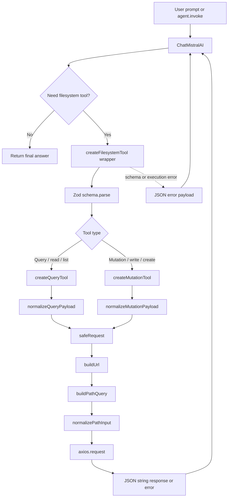

# Architectural Overview & Execution Flow

## 1. High-Level Architecture

The filesystem agent is split into four layers that isolate network I/O, tool construction, tool registration, and model orchestration:

- **Base Request Layer**: `buildUrl()`, `buildPathQuery()`, `normalizeQueryPayload()`, `normalizeMutationPayload()`, and `safeRequest()` convert raw tool input into a stable HTTP request and convert the response back into model-friendly JSON.
- **Factory Layer**: `createFilesystemTool()`, `createQueryTool()`, and `createMutationTool()` remove repeated LangChain wrapper logic and standardize validation, serialization, and error handling.
- **Tool Definition Layer**: the exported constants in `agent.tool.js` map concrete filesystem capabilities to LangChain tool names and HTTP routes.
- **AI Agent Layer**: `ChatMistralAI` and `createAgent()` bind the model to the tool registry, while `SYSTEM_PROMPT` defines the behavioral contract the agent should follow.

Runtime flow is deterministic:

1. Environment variables are loaded.
2. The model and tool objects are created.
3. The agent receives a prompt.
4. The model decides whether to call a tool.
5. The tool validates input, normalizes paths, sends the HTTP request, and returns JSON text.
6. The model reads the result and continues the loop until it can answer.

## 2. Global Configurations & State

`FILE_SERVICE_BASE_URL` is the root URL used by every filesystem request. It is defined in `agent.tool.js` as `process.env.FILE_SERVICE_BASE_URL || "https://shiny-space-capybara-wrp6pw9gwgj6hg5gr-4000.app.github.dev"`. When the environment variable is present, it overrides the hardcoded development fallback. When it is absent, the code uses the default GitHub Codespaces-style endpoint.

This value is consumed by `buildUrl()`, which resolves every route such as `/read`, `/write`, `/files`, and `/create` against the same base origin. That keeps route definitions relative and prevents duplicate URL construction logic across tools.

Environment variables are used in two places:

- `import "dotenv/config"` loads `.env` values before the modules finish evaluating.
- `FILE_SERVICE_BASE_URL` configures the filesystem service endpoint.
- `MISTRALAI_API_KEY` configures the `ChatMistralAI` client in `code.agent.js`.

There is no shared mutable application state in this layer. Each tool invocation is isolated, and all request-specific data is passed through the tool function parameters.

## 3. Runtime Function Call Flow

There are two execution paths in the current codebase:

- **Production agent loop**: a user prompt enters `createAgent()`, the model selects a tool, and the chosen tool executes through the factory and request pipeline.
- **Local test path**: `readFileTesting()` is called immediately at the bottom of `code.agent.js`, so `readWorkspaceFiles.invoke({ path: "src/App.jsx" })` runs as soon as the module loads.

The production call chain for a filesystem request is:

1. `ChatMistralAI` receives the conversation state.
2. `createAgent()` attaches the model to the filesystem tool registry.
3. LangChain selects one exported tool, such as `readWorkspaceFiles` or `writeWorkspaceFile`.
4. `createFilesystemTool()` validates the raw input with Zod.
5. `createQueryTool()` or `createMutationTool()` normalizes the request shape.
6. `safeRequest()` builds the URL and sends the HTTP request.
7. `buildUrl()` resolves the route against `FILE_SERVICE_BASE_URL`.
8. `buildPathQuery()` serializes path input.
9. `normalizePathInput()` turns mixed path shapes into a clean `string[]`.
10. `axios.request()` performs the network call.
11. The response or error is serialized back to JSON text and returned to the model.

## 4. Data Flow & Helper Functions (Step-by-Step)

The route schemas `workspaceReadSchema`, `workspaceQuerySchema`, and `workspaceMutationSchema` are thin Zod wrappers around `workspacePathSchema`. They define which routes require a path, which routes accept an optional path, and which mutation routes also accept `content`, `overwrite`, and optional `type`.

### `workspacePathSchema` (Zod validation)

This schema is the first structural guard for path inputs. It accepts either a single string path or an array of string paths through `z.union([z.string(), z.array(z.string())])`.

Inputs are raw path values coming from LangChain tool calls, query parameters, or manual invocation objects. The output is the validated value itself, or a Zod validation error if the shape is wrong.

Its job is not to normalize syntax. Its job is to stop invalid types early so the rest of the tool pipeline only sees strings or string arrays.

### `normalizePathInput()`

This helper converts the many path shapes the agent may emit into one canonical representation: `string[]`.

It accepts a raw string, an array, an object containing `path` or `path[]`, or `undefined`. It splits comma-delimited values, trims whitespace, removes empty segments, and flattens arrays into a single list.

The result is a clean list of path segments that can be safely serialized into query parameters or reduced into a single mutation target. This prevents malformed payloads like `"src, ,App.jsx"` or mixed `path`/`path[]` query formats from reaching the file service.

### `buildPathQuery()`

This helper serializes normalized path input into a repeated query-string format using `URLSearchParams`.

Its input is the raw path value or query object that `normalizePathInput()` can understand. Its output is a string such as `path=src%2FApp.jsx&path=vite.config.js`.

The repeated-key format matters because it preserves multi-path semantics for read and list operations. If no paths are present, it returns an empty string, which avoids appending a dangling `?` to the URL.

### `buildUrl()`

This helper combines the service base URL with a route path and optional query payload.

Its inputs are a relative route like `/read` or `/create`, plus a query object. Its output is a fully qualified request URL.

Internally it uses `new URL(routePath, FILE_SERVICE_BASE_URL)`, which removes manual string concatenation bugs and ensures every tool targets the same service origin. It then attaches the serialized path query only when one exists.

### `normalizeQueryPayload()` / `normalizeMutationPayload()`

These helpers shape tool input into route-specific request payloads.

`normalizeQueryPayload()` takes parsed tool input and returns an object with one field: `path`, always normalized to `string[]`. This is used by read and list tools.

`normalizeMutationPayload()` takes parsed tool input, validates it with `workspaceMutationSchema`, normalizes the path list, and then enforces mutation rules. It returns a request body with a single `path`, `content`, `overwrite`, and an optional `type`.

The mutation normalizer prevents several classes of errors:

- It rejects missing paths.
- It rejects more than one path for write/create operations.
- It enforces `fixedType` when the factory requires a specific resource type.
- It applies defaults for `content` and `overwrite`, which reduces prompt burden on the LLM.

This is the layer that turns ambiguous model output into a precise filesystem command.

### `safeRequest()`

This helper is the final transport wrapper before the filesystem service is called.

Its inputs are the HTTP method, route path, normalized query object, and request body. Its output is always a JSON string, either containing the response body or an error object.

It prevents agent-loop crashes in two ways:

- `validateStatus: () => true` stops Axios from throwing on non-2xx HTTP responses, so the model can inspect the actual response payload.
- The `catch` block converts transport failures into serialized JSON instead of rethrowing them, which keeps LangChain tool execution stable.

Because the return value is serialized JSON text, the model can read failures as structured data and decide how to recover instead of losing the entire turn.

## 5. The Factory Engine

`createFilesystemTool()` is the shared higher-order wrapper around LangChain `tool()`. It accepts a tool name, description, schema, and execution function, then returns a fully configured LangChain tool instance. It parses raw tool input, forwards the parsed payload to the runner, and converts any schema or execution failure into JSON error text.

`createQueryTool()` is the GET-specialized factory. It injects `safeRequest()` with `method: "get"` and uses `normalizeQueryPayload()` so all query-style tools share the same request path.

`createMutationTool()` is the POST-specialized factory. It injects `safeRequest()` with `method: "post"` and uses `normalizeMutationPayload()` so create and write tools all obey the same mutation contract.

These factories eliminate duplicate code in three places at once:

- They centralize validation.
- They centralize request serialization.
- They centralize tool-level error formatting.

That means adding a new filesystem capability only requires a route name, a description, and the correct schema or fixed type. The wrapper logic does not need to be rewritten for each new tool.

## 6. Tool Registry Reference Table

| Tool Constant Name           | LangChain Tool Name            | Route Path      | Target Action                                                  |
| ---------------------------- | ------------------------------ | --------------- | -------------------------------------------------------------- |
| `readWorkspaceFiles`       | `read_workspace_files`       | `/read`       | Read one or more files from the workspace                      |
| `listWorkspaceEntries`     | `list_workspace_entries`     | `/files`      | List entries for one or more workspace paths                   |
| `listWorkspaceTree`        | `list_workspace_tree`        | `/list-files` | Recursively list the workspace tree                            |
| `writeWorkspaceFile`       | `write_workspace_file`       | `/write`      | Update or overwrite an existing workspace file                 |
| `createWorkspaceFile`      | `create_workspace_file`      | `/create`     | Create a new workspace file with fixed type `file`           |
| `createWorkspaceDirectory` | `create_workspace_directory` | `/create`     | Create a new workspace directory with fixed type `directory` |
| `readFilesAlias`           | `read_workspace_files_alias` | `/read-files` | Alias route for reading files                                  |
| `readFilses`               | `read_workspace_files`       | `/read`       | Alias export of `readWorkspaceFiles`                         |
| `seeAllFIles`              | `list_workspace_entries`     | `/files`      | Alias export of `listWorkspaceEntries`                       |

Alias exports reuse the same underlying tool instance. They do not create new routes or new transport logic.

## 7. The AI Orchestration Layer

`ChatMistralAI` is the model client that interprets the prompt, chooses when to call a tool, and reasons over the returned tool output. In `code.agent.js`, it is configured with `model: "mistral-large-latest"`, `apiKey: process.env.MISTRALAI_API_KEY`, and `temperature: 0.7`.

`createAgent()` binds that model to the tool registry. This is what turns the model from a plain chat client into an agent that can inspect files, list directories, create files, and write updates. The tool set passed to `createAgent()` is the complete filesystem capability surface available to the model.

`SYSTEM_PROMPT` is the operational playbook for the agent. Its most important instruction is the read-before-write rule: the agent must inspect existing files, understand structure and imports, and only then modify code. That constraint reduces hallucinated file paths, avoids style drift, and helps the model preserve existing architecture instead of overwriting it blindly.

The prompt also tells the agent to:

- prefer existing files over unnecessary new files,
- use `listWorkspaceEntries()` when path uncertainty exists,
- use `readWorkspaceFiles()` before `writeWorkspaceFile()` for edits,
- keep output production-ready,
- and explain what it read and changed.

Important implementation detail: `SYSTEM_PROMPT` is exported, but it is not automatically injected into the `createAgent()` call in the current source. It becomes active only when the caller includes it as a system message. The commented `testing()` example shows the intended usage pattern.

Also note the current module side effect at the bottom of `code.agent.js`: `readFileTesting()` runs immediately and invokes `readWorkspaceFiles` for `src/App.jsx`. That is a local test harness, not the main agent loop. The commented block below it demonstrates the intended orchestration flow where the system prompt and user request drive the full agent loop.
