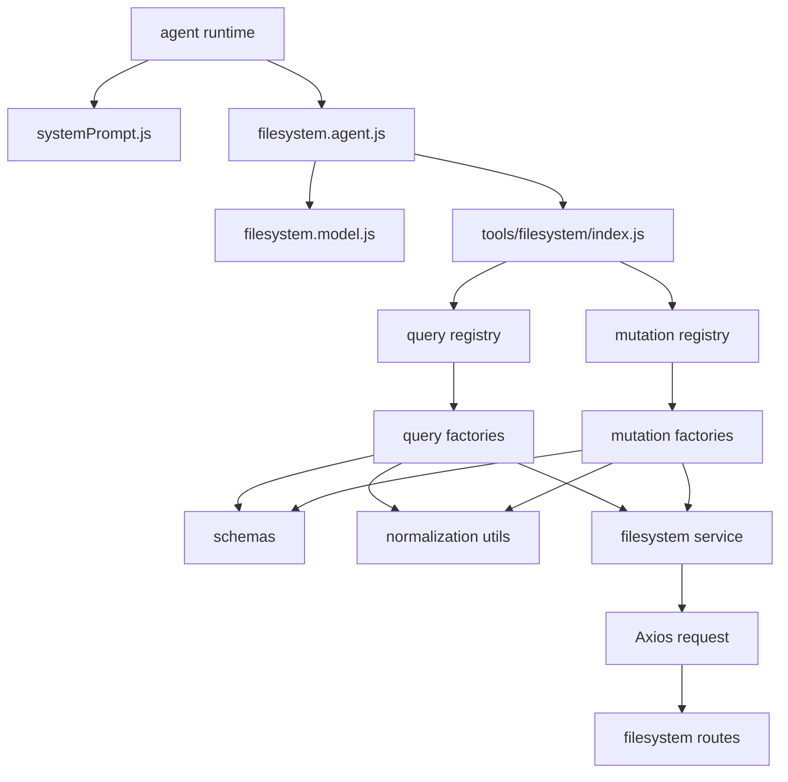

# AI Filesystem Agent Modular Refactor

## Before Architecture Problem
The original implementation kept validation, path normalization, HTTP transport, tool factories, and tool registration in a single module. That made the file easy to start with, but expensive to maintain.

Key issues:

- Tool logic and transport logic were coupled together.
- Normalization and schema rules were mixed into the same file as LangChain tool creation.
- The agent module created runtime side effects at import time.
- Future concerns like auth, retries, caching, telemetry, or audit logging had no clear insertion point.
- Adding a new route required editing the same monolithic file and risking regression in unrelated tools.

## After Architecture Improvement
The refactor separates the system into explicit layers:

```text
src/
|-- agents/
|   |-- systemPrompt.js
|   |-- filesystem.model.js
|   |-- filesystem.agent.js
|   `-- code.agent.js
`-- tools/
    `-- filesystem/
        |-- schemas/
        |-- utils/
        |-- services/
        |-- factories/
        |-- query/
        |-- mutation/
        `-- index.js
```

## Mermaid Architecture Diagram
The diagram below shows the dependency direction and the runtime path from the agent down to the filesystem service. Read it from top to bottom.



### Diagram Explanation
- `agent runtime` is the orchestration entrypoint that consumes the modular stack.
- `systemPrompt.js` defines the operating policy that tells the agent how to behave.
- `filesystem.agent.js` composes the model and tool registry into one agent instance.
- `filesystem.model.js` owns the Mistral client configuration.
- `tools/filesystem/index.js` is the public filesystem entrypoint.
- `query registry` and `mutation registry` split read-only capabilities from write-capable capabilities.
- `query factories` and `mutation factories` build LangChain tools without duplicating wrapper logic.
- `schemas` validate the raw input before any request is attempted.
- `normalization utils` canonicalize paths and payloads so the model can emit flexible input formats.
- `filesystem service` owns URL building and network transport.
- `Axios request` performs the actual HTTP call to the backend filesystem routes.

This diagram shows why the architecture scales well:

- validation is isolated,
- path handling is isolated,
- transport is isolated,
- tool creation is isolated,
- and agent orchestration stays thin.

### Layer Responsibilities

| Layer | Responsibility | Example Modules |
|---|---|---|
| Validation | Validate shapes and route contracts | `schemas/workspace.schemas.js` |
| Normalization | Canonicalize paths and payloads | `utils/path.utils.js`, `utils/payload.utils.js` |
| Transport | Build URLs and execute HTTP requests | `services/filesystem.service.js` |
| Factory | Build LangChain tool wrappers | `factories/*.factory.js` |
| Tool Registry | Register concrete filesystem capabilities | `query/*.tool.js`, `mutation/*.tool.js`, `index.js` |
| Agent Orchestration | Compose model, prompt, and tools | `agents/*.js` |

## Dependency Direction
The dependency flow is intentionally one-way:

```text
schemas -> utils -> services -> factories -> query/mutation -> tools index -> agents
```

Rules:

- `schemas` should not import transport or agent code.
- `utils` should not know about LangChain or Axios.
- `services` should not know about prompt text or tool names.
- `factories` may use `services`, `utils`, and `schemas`.
- `query` and `mutation` modules should only assemble tools.
- `agents` should only compose the public tool registry.

This prevents circular dependencies and keeps the architecture easy to grow.

## Why Each Abstraction Exists

- **Schemas** exist to enforce correctness before execution.
- **Normalization** exists to turn messy model output into stable request shapes.
- **Transport** exists to isolate network behavior so retries, auth, and logging can be added later.
- **Factories** exist to remove boilerplate when new tools are introduced.
- **Query and mutation separation** exists because read-only and write-capable operations have different risk profiles.
- **Tool registry barrels** exist so the agent imports one public entrypoint.

## Where To Add New Capabilities

### New GET Route
Add a new file under `src/tools/filesystem/query/`, then register it in `src/tools/filesystem/query/index.js` and the root `src/tools/filesystem/index.js`.

### New POST Route
Add a new file under `src/tools/filesystem/mutation/`, then register it in `src/tools/filesystem/mutation/index.js` and the root `src/tools/filesystem/index.js`.

### Middleware
Transport middleware belongs in `src/tools/filesystem/services/filesystem.service.js` or in a wrapper directly above that service layer.

### Auth
Auth tokens should be injected in the transport layer, not in the tool files. That keeps secrets away from prompt logic and tool declarations.

### Retries
Retries belong in the transport layer. That is where request failure, timeout, and backoff behavior can be handled uniformly.

### Caching
Caching belongs closest to transport or a dedicated service wrapper, depending on whether the cache is request-level or content-level.

### Logging
Structured logging belongs in the transport layer and optionally in the factory layer for tool-level telemetry.

### Rate Limiting
Rate limiting should be added at the service boundary, or one layer above it if the limit is tied to agent behavior rather than request execution.

## Example Imports And Exports

```js
import { readWorkspaceFiles } from "../tools/filesystem/query/index.js";
import { filesystemTools } from "../tools/filesystem/index.js";
import { SYSTEM_PROMPT } from "./systemPrompt.js";
```

```js
export { SYSTEM_PROMPT } from "./systemPrompt.js";
export { agent, createFilesystemAgent } from "./filesystem.agent.js";
```

## New Route Examples

### Add A New GET Route
1. Create `src/tools/filesystem/query/myNewRoute.tool.js`.
2. Build it with `createQueryTool()`.
3. Export it from `src/tools/filesystem/query/index.js`.
4. Add it to the root registry in `src/tools/filesystem/index.js`.

### Add A New POST Route
1. Create `src/tools/filesystem/mutation/myNewMutation.tool.js`.
2. Build it with `createMutationTool()`.
3. Export it from `src/tools/filesystem/mutation/index.js`.
4. Add it to the root registry in `src/tools/filesystem/index.js`.

### Add Middleware
Use a wrapper around `safeRequest()` or extend the service layer to inject headers, tracing, or preflight checks.

### Add Auth
Inject auth headers inside `safeRequest()` so the rest of the architecture never needs to know about token handling.

### Add Retries
Implement retries inside `safeRequest()` or a lower-level transport helper so every tool inherits the same retry policy.

### Add Telemetry
Instrument `safeRequest()` and optionally `createFilesystemTool()` to emit request timing, tool names, and success/failure metadata.

## Future-Ready Notes

- **WebSocket streaming**: introduce a separate streaming transport service rather than changing the current request service.
- **Multi-workspace support**: add workspace context to schema and transport layers, not to the agent prompt.
- **Auth tokens**: pass them through the service boundary via headers or a configured client.
- **Audit logging**: capture tool name, route, status, and workspace context in the transport layer.
- **AI memory integration**: keep memory as an agent concern, separate from filesystem tools.
- **Vector search integration**: add a separate retrieval service or agent capability, not a filesystem tool.
- **Distributed agent systems**: split orchestration into specialized agents that share the same filesystem tool registry when appropriate.

## How To Scale This System In Future

Use the current modular shape as the base for larger infrastructure:

- **Redis** for caching, session state, or distributed locks.
- **Queues** for long-running file operations or background indexing.
- **Worker systems** for offline processing, code review, or file reconciliation.
- **Microservices** for auth, filesystem access, telemetry, and agent orchestration.
- **Distributed agents** for planning, editing, testing, and review specialization.
- **Event-driven architecture** for file-change events, audit streams, and index updates.
- **Observability** for traces, metrics, structured logs, and tool-call inspection.
- **Monitoring** for latency, error rate, token usage, and workspace-level health.

## Enterprise Scaling Guidance
The architecture is now ready for enterprise growth because each concern has one owner:

- Policy and validation live in schemas.
- Data shaping lives in utils.
- Network behavior lives in services.
- Tool wiring lives in factories.
- Capability registration lives in query and mutation modules.
- Agent composition lives in the agents layer.

That means the system can grow without turning the core filesystem agent back into a monolith.
