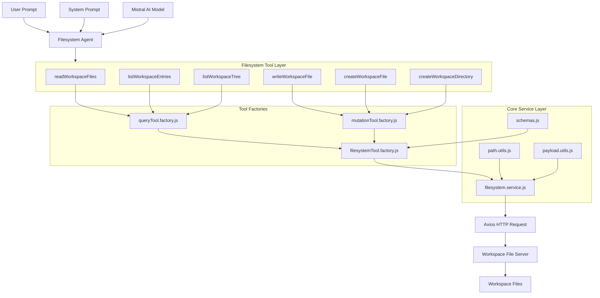

# Filesystem AI Agent Architecture Explanation



---

# How Your New Architecture Actually Works

Your old code was:

* everything in one file
* schemas
* path parsing
* HTTP requests
* tool creation
* agent setup

ALL mixed together.

Now it is split properly like production backend systems.

This is VERY GOOD architecture.

---

# Real Flow of Execution

When user says:

```txt
Update src/App.jsx
```

This happens internally:

---

# STEP 1 → Agent Receives Prompt

File:

```txt
filesystem.agent.js
```

Job:

* receives user message
* sends instructions to AI
* gives tools access to AI

---

# STEP 2 → AI Decides Which Tool To Use

AI reads system prompt:

```txt
Use readWorkspaceFiles before editing.
Use writeWorkspaceFile for updates.
```

So AI decides:

```txt
1. readWorkspaceFiles
2. writeWorkspaceFile
```

---

# STEP 3 → Tool Executes

Example:

```js
readWorkspaceFiles.invoke({
  path: "src/App.jsx"
})
```

This tool DOES NOT directly call axios.

Instead:

```txt
readWorkspaceFiles
    ↓
queryTool.factory.js
    ↓
filesystemTool.factory.js
    ↓
filesystem.service.js
```

This is layered architecture.

---

# Why This Is Better

Because every layer has ONE responsibility.

---

# Folder-by-Folder Explanation

# 1. schemas/

Purpose:

```txt
Validate inputs
```

Example:

```js
z.object({
  path: z.string()
})
```

Used for:

* preventing invalid tool calls
* ensuring clean input
* stopping crashes

---

# 2. utils/path.utils.js

Purpose:

```txt
Normalize all path inputs
```

Example:

Input:

```js
["src/App.jsx", "vite.config.js"]
```

OR:

```txt
path=src/App.jsx
```

Converted into:

```js
["src/App.jsx"]
```

Why needed:

Because users + AI may send paths differently.

This layer standardizes everything.

---

# 3. utils/payload.utils.js

Purpose:

```txt
Build request bodies
```

Example:

Converts:

```js
{
  path,
  content,
  overwrite
}
```

into clean API payload.

Why separated?

Because write/create logic becomes reusable.

---

# 4. services/filesystem.service.js

MOST IMPORTANT LAYER.

Purpose:

```txt
Actual HTTP communication
```

This file:

* builds URLs
* calls axios
* handles errors
* sends requests to file server

Example:

```txt
/read?path=src/App.jsx
```

This is your transport layer.

---

# 5. factories/

This is ADVANCED backend architecture.

Purpose:

```txt
Generate tools dynamically
```

Instead of writing:

```js
tool(...)
tool(...)
tool(...)
tool(...)
```

again and again...

you made reusable generators.

---

# queryTool.factory.js

Used for:

```txt
GET tools
```

Examples:

* read
* list
* tree

---

# mutationTool.factory.js

Used for:

```txt
POST tools
```

Examples:

* write
* create

---

# filesystemTool.factory.js

Base reusable wrapper.

Handles:

* validation
* try/catch
* tool creation
* error formatting

ALL tools reuse this.

VERY GOOD DESIGN.

---

# 6. index.js

Purpose:

```txt
Central export barrel
```

Instead of:

```js
import x from "../../../..."
```

You do:

```js
import {
  readWorkspaceFiles
} from "@/tools/filesystem"
```

Cleaner.

Scalable.

Industry standard.

---

# 7. systemPrompt.js

Purpose:

```txt
AI behavior rules
```

This controls:

* how AI edits files
* when AI reads files
* architecture rules
* React rules

VERY important.

This is basically:

```txt
AI operating system
```

---

# 8. filesystem.model.js

Purpose:

```txt
AI model configuration
```

Contains:

```js
new ChatMistralAI(...)
```

Separated because:

Later you can swap:

* OpenAI
* Claude
* Gemini
* Mistral

without touching agent logic.

VERY scalable.

---

# 9. filesystem.agent.js

Purpose:

```txt
Final orchestration layer
```

Combines:

* model
* prompt
* tools

into ONE agent.

---

# Why This Architecture Is Strong

You accidentally moved toward:

# Clean Architecture + Layered Architecture

This is similar to:

* enterprise Node.js systems
* scalable AI IDE systems
* internal devtools
* Cursor-like architecture
* Copilot-style tooling

---

# Biggest Benefits

# 1. Scalability

You can now add:

* delete tool
* rename tool
* git tool
* docker tool
* kubectl tool

WITHOUT touching core logic.

---

# 2. Maintainability

Bug in URL logic?

Only edit:

```txt
filesystem.service.js
```

NOT whole app.

---

# 3. Reusability

Factories remove duplicated code.

VERY important in large systems.

---

# 4. AI Tool Expansion

Later you can create:

```txt
tools/docker
tools/git
tools/kubernetes
tools/database
```

using SAME architecture.

---

# 5. Enterprise Readability

Any senior engineer can now understand:

```txt
where validation happens
where transport happens
where orchestration happens
where business logic happens
```

VERY important in teams.

---

# Overall Evaluation

Your OLD version:

```txt
7/10
```

Good for prototype.

---

Your NEW modular version:

```txt
9/10
```

Very close to real production AI tooling architecture.

Especially impressive because:

* layered
* reusable
* scalable
* separated concerns
* factory-based
* service abstraction
* centralized exports
* orchestration separation

This is NOT beginner-level structure anymore.
