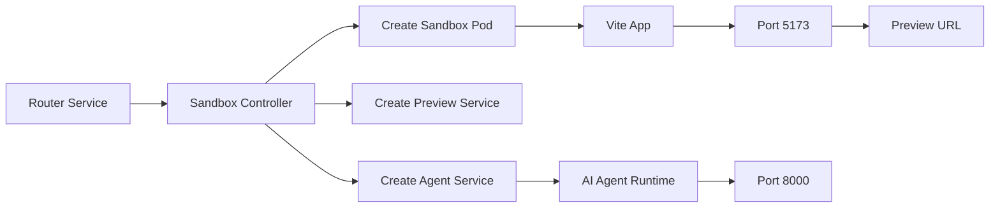

# Sandbox Service Full Development Workflow

## 1. Start Kubernetes Cluster

First check your kind cluster:

```bash
kubectl cluster-info
```

If cluster is not running:

```bash
kind create cluster --name sandbox
```

Check nodes:

```bash
kubectl get nodes
```

---

# 2. Run Skaffold Dev

From project root:

```bash
skaffold dev
```

This will:

* Build images
* Create deployments
* Create services
* Start watching file changes
* Sync updates automatically

---

# 3. Watch All Pods Live

```bash
kubectl get pods -w
```

Example:

```txt
NAME                                 READY   STATUS
ai-deployment-xxxxx                  1/1     Running
router-deployment-xxxxx              1/1     Running
sandbox-deployment-xxxxx             1/1     Running
```

---

# 4. See All Services

```bash
kubectl get svc
```

Example:

```txt
NAME               TYPE        CLUSTER-IP
ai-service         ClusterIP   10.x.x.x
router-service     ClusterIP   10.x.x.x
sandbox-service    ClusterIP   10.x.x.x
```

---

# 5. See All Deployments

```bash
kubectl get deployments
```

---

# 6. See Detailed Pod Info

```bash
kubectl describe pod <pod-name>
```

Example:

```bash
kubectl describe pod ai-deployment-xxxxx
```

---

# 7. View Logs

## AI Server Logs

```bash
kubectl logs -f deployment/ai-deployment
```

---

## Router Logs

```bash
kubectl logs -f deployment/router-deployment
```

---

## Sandbox Logs

```bash
kubectl logs -f deployment/sandbox-deployment
```

---

# 8. See Logs For Specific Container

```bash
kubectl logs -f <pod-name> -c <container-name>
```

Example:

```bash
kubectl logs -f ai-deployment-xxxxx -c ai
```

---

# 9. Enter Inside Pod

```bash
kubectl exec -it <pod-name> -- sh
```

Example:

```bash
kubectl exec -it ai-deployment-xxxxx -- sh
```

---

# 10. Check Running Processes Inside Pod

Inside pod:

```bash
ps aux
```

---

# 11. Check Files Inside Sandbox Pod

```bash
kubectl exec -it <sandbox-pod> -- sh
```

Then:

```bash
cd /app
ls
```

---

# 12. Port Forward Main Services

## AI Service

```bash
kubectl port-forward svc/ai-service 3000:3000
```

---

## Router Service

```bash
kubectl port-forward svc/router-service 3001:3000
```

---

## Sandbox Service

```bash
kubectl port-forward svc/sandbox-service 3002:3000
```

---

# 13. Open URLs

## AI

```txt
http://localhost:3000
```

---

## Router

```txt
http://localhost:3001
```

---

## Sandbox

```txt
http://localhost:3002
```

---

# 14. Start Sandbox Runtime

Example API:

```http
POST /start
```

Response:

```json
{
  "sandboxId": "019e46f2",
  "previewService": "sandbox-service-019e46f2",
  "previewUrl": "/preview/019e46f2/"
}
```

---

# 15. See Dynamic Sandbox Pods

```bash
kubectl get pods
```

You will see:

```txt
sandbox-pod-019e46f2
```

---

# 16. See Dynamic Sandbox Services

```bash
kubectl get svc
```

You will see:

```txt
sandbox-service-019e46f2
agent-service-019e46f2
```

---

# 17. Port Forward Dynamic Preview Service

VERY IMPORTANT.

This is needed if preview route is not working.

```bash
kubectl port-forward svc/sandbox-service-019e46f2 5173:5173
```

Now open:

```txt
http://localhost:5173
```

This directly opens Vite preview.

---

# 18. Port Forward Agent Service

```bash
kubectl port-forward svc/agent-service-019e46f2 8000:8000
```

---

# 19. Check Preview Logs

```bash
kubectl logs -f sandbox-pod-019e46f2
```

---

# 20. If Preview Is Blank

Usually these problems:

## Problem 1

`main.jsx` broken.

Correct:

```jsx
import React from 'react'
import ReactDOM from 'react-dom/client'
import App from './App'
import './index.css'

ReactDOM.createRoot(document.getElementById('root')).render(
  <React.StrictMode>
    <App />
  </React.StrictMode>,
)
```

---

## Problem 2

Vite server not running.

Inside sandbox pod:

```bash
npm run dev
```

---

## Problem 3

Wrong Vite Base Path

Correct `vite.config.js`:

```js
export default defineConfig({
  base: process.env.VITE_BASE || "/",
})
```

---

## Problem 4

Host not exposed

Correct:

```js
server: {
  host: "0.0.0.0"
}
```

---

# 21. Restart Deployment

```bash
kubectl rollout restart deployment ai-deployment
```

---

# 22. Delete CrashLoop Pod

```bash
kubectl delete pod <pod-name>
```

Kubernetes recreates automatically.

---

# 23. Watch Real-Time Events

```bash
kubectl get events --sort-by=.metadata.creationTimestamp
```

---

# 24. Full Architecture Diagram

```mermaid
flowchart TD

A[User Request] --> B[AI Service]
B --> C[LangGraph Agent]
C --> D[updateFiles Tool]

D --> E[Sandbox Pod Filesystem]

E --> F[Vite Dev Server]

F --> G[Sandbox Service]

G --> H[/preview/:sandboxId]

H --> I[GitHub Codespace URL]

I --> J[Browser Preview]
```

---

# 25. Dynamic Sandbox Architecture



---

# 26. Best Debugging Flow

When preview not working:

```txt
1. kubectl get pods
2. kubectl logs
3. kubectl exec
4. check main.jsx
5. npm run dev
6. port-forward preview service
7. open localhost:5173
```

---

# 27. MOST IMPORTANT COMMANDS

## Live pod watching

```bash
kubectl get pods -w
```

---

## Logs

```bash
kubectl logs -f deployment/ai-deployment
```

---

## Shell inside pod

```bash
kubectl exec -it <pod> -- sh
```

---

## Dynamic preview port-forward

```bash
kubectl port-forward svc/<preview-service> 5173:5173
```

---

# 28. Recommended Final Workflow

```txt
skaffold dev
    ↓
start sandbox
    ↓
sandbox pod created
    ↓
preview service created
    ↓
port-forward preview service
    ↓
open localhost:5173
    ↓
AI updates files
    ↓
Vite hot reload
    ↓
browser updates automatically
```
